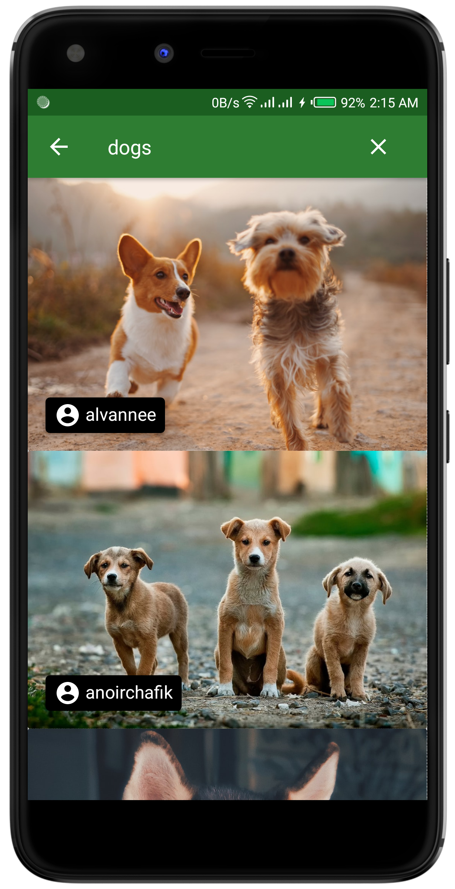
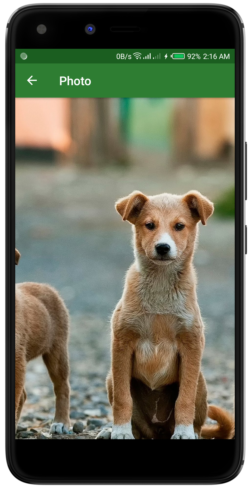

# Image Search App Tutorial by Coding in flow

By following the course, I built an app that can search the Unsplash API for images and display them in a RecyclerView using MVVM architecture, Paging 3, Glide, Retrofit, Coroutines, the Navigation Component, View Binding, and Dagger Hilt.

||||
|:----:|:----:|:----:|

### Watch the course here:
[Coding in flow Youtube Tutorial]https://www.youtube.com/playlist?list=PLrnPJCHvNZuC_pEfFlZuTmjlY4T3DTtED

## Contributing
Pull requests are welcome.

## License

   Copyright 2020 Stephen K
   
   Licensed under the Apache License, Version 2.0 (the "License");
   you may not use this file except in compliance with the License.
   You may obtain a copy of the License at [APACHE LICENSE, VERSION 2.0](https://www.apache.org/licenses/LICENSE-2.0).
   Unless required by applicable law or agreed to in writing, software
   distributed under the License is distributed on an "AS IS" BASIS,
   WITHOUT WARRANTIES OR CONDITIONS OF ANY KIND, either express or implied.
   See the License for the specific language governing permissions and
   limitations under the License.
